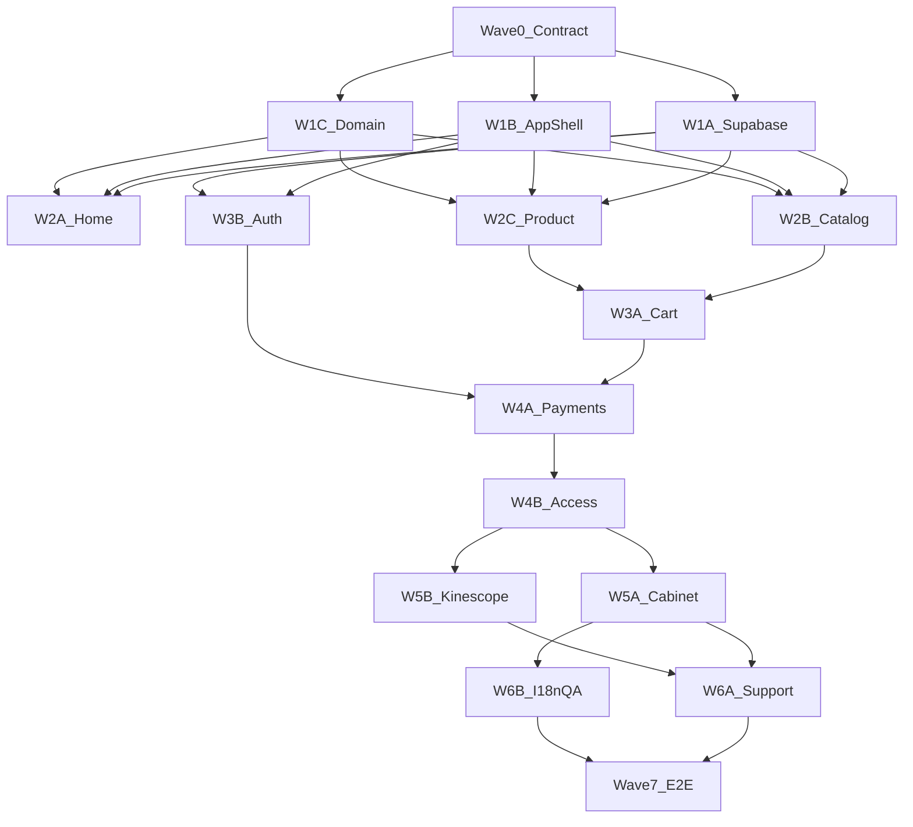

# План: сайт-каталог + Supabase

Исполняемый бриф для агентов. Спека и макет: [catalog.md](catalog.md). Клуб `/privateclub/` не перевёрстывать и не ломать.

Агенты: **только grok или composer**. Перед каждой волной прочитать этот файл, [catalog.md](catalog.md) и `.cursor/rules/web-catalog.mdc`.

Цель: грамотный, красивый, удобный продукт без дыр, багов и костылей. Figma — пол. Качество — потолок.

База — **тот же self-hosted Supabase**, что уже в репо (`NEXT_PUBLIC_SUPABASE_URL` / `api.betango.dance`, `database-schema/`, `supabase/functions`). Не Firebase. Не второй облачный проект «с нуля», пока человек явно не скажет.

---

## Как работать волнами



- Внутри волны треки **параллельны**. Между волнами — только после merge и зелёного Definition of Done.
- Треки одной волны **не правят одни и те же файлы**. Контракт ниже — единственная общая поверхность.
- Не начинать UI экрана без Figma MCP: skill `figma-design-to-code` → `get_design_context` + screenshot **конкретной** node-id из [catalog.md](catalog.md).
- Иконки — только экспорт из Figma в `public/assets/site/` (или `src/assets/site/`). Не рисовать, не icon pack, не просроченные MCP URL в репо.
- Динамика только из Supabase. Пока грузится — скелетон в геометрии карточек. Никаких массивов «пример урока» в компонентах.
- Перед миграциями и деплоем функций: это **тот** инстанс (`api.betango.dance` / URL из env). Не катить SQL на чужой проект. Схему смотреть по факту (`public-schema.sql` + live), не угадывать колонки ботов.
- Таблицы ботов (`bot_users`, `subscriptions`, `payments`, …) **не переписывать**. Каталог — новые таблицы с префиксом `catalog_`.
- Существующие `create-checkout` и `stripe-webhook` — для **Telegram-бота**. Каталог получает **свои** Edge Functions, ботовые не ломать.
- `output: "export"` и клуб не ломать: секреты и вебхуки — **Supabase Edge Functions**, не Next API routes.
- Не коммитить секреты. Клиенту — только `NEXT_PUBLIC_SUPABASE_URL` и `NEXT_PUBLIC_SUPABASE_ANON_KEY`. Service role — только скрипты и Edge Functions.

---

## Архитектура (зафиксировано)

| Слой | Решение |
| --- | --- |
| Хостинг фронта | Как сейчас: статический Next (`output: "export"`), `/` каталог, `/privateclub/` клуб |
| Auth | Supabase Auth (GoTrue): email + пароль, reset по email |
| Данные | Postgres на текущем Supabase, RLS |
| Файлы | Supabase Storage: вложения поддержки; обложки — public bucket или HTTPS, заливка сидом, не из UI магазина |
| Секреты / побочные эффекты | Edge Functions: checkout каталога, Stripe webhook каталога, Kinescope token, релей в TG-поддержку |
| Платежи | Stripe Checkout (уже есть для бота). Не фейковый «успех». Отдельные функции и таблицы заказов каталога |
| Видео | Kinescope + DRM. `kinescope_id` **не** в SELECT для `anon` / `authenticated` |
| i18n | `ru` (дефолт) + `en`. Модель двуязычная с Wave 1, UI en — Wave 6 |
| Админка | Нет. Сид: `scripts/seed-catalog.ts` или SQL через service role |

### Вёрстка: гибрид, не один огромный canvas

Клуб на FigCanvas (1920 / 360 absolute) — ок для лендинга. Каталог — **магазин с формами**.

- **Маркетинговая главная** (длинный арт): можно тот же приём, что клуб — desktop/mobile кадры из Figma 1:1.
- **Каталог, карточка, корзина, auth, ЛК, плеер:** document flow + токены (Involve, plum, бренд-градиент из `globals.css`). Размеры и сетка **как в Figma**, но не `position: absolute` на 8000px.
- Брейкпоинт как у клуба: телефон ≤600px → кадр 360; иначе desktop 1920. Не выдумывать третий макет.

### Маршруты (`trailingSlash: true`)

| URL | Экран |
| --- | --- |
| `/` | Главная |
| `/catalog/` | Каталог; фильтр `?type=` |
| `/product/[id]/` | Продукт |
| `/cart/` | Корзина |
| `/checkout/` | Итог заказа → Stripe |
| `/login/` | Вход |
| `/signup/` | Регистрация |
| `/forgot-password/` | Сброс |
| `/account/` | Мои материалы |
| `/account/course/[id]/` | Курс в ЛК |
| `/account/watch/[id]/` | Урок / лайфхак / исследование |
| `/account/profile/` | Профиль |
| `/account/orders/` | История покупок |
| `/account/support/` | Чат |
| `/account/expired/` | Заглушка истекшего доступа |
| `/en/...` | Те же пути, Wave 6 |

Папки: `src/app/(site)/...`. Клуб остаётся в `src/app/privateclub/`.

Код каталога: `src/components/site/`, `src/lib/catalog/`, `src/lib/supabase/`. Не складывать в `components/landing/`.

---

## Контракт данных (Wave 0, общий для всех)

Типы живут в `src/lib/catalog/types.ts`. Менять поля после Wave 0 — только отдельным PR с миграцией.

```ts
export type Locale = "ru" | "en";
export type ProductType =
  | "lifehack"
  | "lesson"
  | "course"
  | "extra"
  | "research"
  | "peek";
export type AccessStatus = "active" | "expired";
export type OrderStatus = "pending" | "paid" | "failed" | "canceled";

export type ProductI18n = {
  title: string;
  short: string;
  description: string;
  program?: string;
};

export type Product = {
  id: string;
  type: ProductType;
  priceMinor: number;
  currency: "rub" | "eur" | "usd";
  accessDays: number;
  coverUrl: string;
  durationSec: number;
  level: string;
  skills: string[];
  lessonCount?: number;
  i18n: Record<Locale, ProductI18n>;
  published: boolean;
};
```

`kinescopeId` в клиентский `Product` **не входит**.

### Postgres (префикс `catalog_`)

Имена зафиксировать в миграции `database-schema/migrations/016_catalog.sql` (номер — следующий свободный после существующих `015_*`).

```
catalog_products
  id uuid pk
  type text
  price_minor int
  currency text
  access_days int
  cover_url text
  duration_sec int
  level text
  skills text[]
  lesson_count int null
  published bool
  created_at / updated_at

catalog_product_i18n
  product_id fk
  locale text  -- ru | en
  title, short, description, program
  primary (product_id, locale)

catalog_product_videos
  product_id fk
  locale text
  kinescope_id text
  -- RLS: нет SELECT для anon/authenticated; только service_role

catalog_settings
  key text pk  -- 'wholesale_tiers'
  value jsonb

catalog_profiles
  id uuid pk references auth.users
  email text
  created_at

catalog_cart_items
  user_id uuid
  product_id uuid
  qty int
  added_at
  primary (user_id, product_id)

catalog_orders
  id uuid pk
  user_id uuid
  status text
  subtotal_minor, discount_minor, total_minor
  currency
  stripe_session_id text unique
  created_at

catalog_order_items
  order_id, product_id, title_snapshot, price_minor, qty

catalog_access
  user_id, product_id
  order_id
  purchased_at, expires_at
  status  -- active | expired
  primary (user_id, product_id)

catalog_support_messages
  id, user_id, from_role  -- user | agent
  body text
  storage_path text null
  created_at

catalog_notifications
  id, user_id, type, title, body, href, read, created_at
```

Триггер: после signup в `auth.users` — строка в `catalog_profiles`.

### RLS (смысл)

- `catalog_products` + `catalog_product_i18n`: `SELECT` если `published`; `INSERT/UPDATE/DELETE` нет у клиента.
- `catalog_product_videos`: политики для `anon`/`authenticated` не создавать (доступ только service_role / Edge Function).
- `catalog_cart_items`, `catalog_support_messages`, `catalog_notifications`, `catalog_profiles`: только `auth.uid() = user_id`.
- `catalog_access`, `catalog_orders`: `SELECT` свой; `INSERT/UPDATE` — service_role (webhook).
- Storage: bucket `catalog-support`, путь `{user_id}/...`, только владелец.

Индексы: `catalog_products (published, type)`, `catalog_access (user_id, status)`, `catalog_orders (user_id, status)`.

### Репозитории

`src/lib/catalog/repo/*.ts` — единственное место запросов Supabase с клиента. Компоненты не вызывают `supabase.from` напрямую.

---

## Wave 0 — контракт (1 агент, коротко)

1. Этот план + типы `src/lib/catalog/types.ts`.
2. Пустые репозитории с сигнатурами (без мок-данных).
3. Каркас папок `src/components/site/`, `src/lib/supabase/`.
4. `.env.example` уже содержит `NEXT_PUBLIC_SUPABASE_*` — не плодить другой префикс.
5. Снять редирект `/` → `/privateclub/` только когда главная готова (Wave 2A). До этого редирект не трогать.

**DoD:** типы компилятся, маршруты перечислены, клубный билд зелёный.

---

## Wave 1 — фундамент (3 трека параллельно)

### 1A — Supabase: схема, RLS, функции-заготовки

**Владеет:** `database-schema/migrations/016_catalog.sql` (и следующие, если сплит), `supabase/functions/catalog-create-checkout/`, `catalog-stripe-webhook/`, `kinescope-token/`, `catalog-relay-support/`, `scripts/seed-catalog.ts`, `supabase/config.toml` (новые functions).

- Миграция только `catalog_*`. Не ALTER ботовых таблиц.
- RLS force, гранты как у ботов: клиент не пишет access/orders/videos.
- Auth: Email/Password на этом инстансе, шаблон reset (ru).
- Storage bucket + policies.
- Каркас Edge Functions (пока 401/501 осмысленный, не дыра). `catalog-create-checkout` — `verify_jwt = true`. Webhook — `verify_jwt = false`.
- Сид через service role. Пустая база допустима; UI не наполняет фейками.
- `catalog_settings.wholesale_tiers` — jsonb-массив. Пороги % не выдумывать без человека (в dev можно один тестовый тир).

**DoD:** на инстансе: signup → `catalog_profiles`; `select` пустых published products с anon; `select catalog_product_videos` с anon **падает**. Ботовый checkout не сломан.

**Не трогает:** UI, `src/app`, `components/landing`, `supabase/functions/create-checkout`, `stripe-webhook` бота.

### 1B — оболочка сайта

**Владеет:** `src/app/(site)/layout.tsx`, нав/футер каталога, i18n-каркас, `src/components/site/ui/` (кнопка, скелетон, поле).

Figma: шапка/подвал с главной `572:1864` и `722:4311`; состояния инпута `656:10146`.

- Общий `app/layout.tsx` — только html/body/шрифт, клуб не ломать.
- `Skeleton` — шиммер в палитре макета, без layout shift.
- Нав: `/catalog/`, `/cart/`, `/login/` или `/account/` по сессии Supabase Auth (реальный клиент, не мок-юзер).

**DoD:** пустые маршруты рендерятся, скелетон как карточка, `/privateclub/` прежний.

**Не трогает:** SQL, Edge Functions, страницы продуктов.

### 1C — домен и клиент Supabase

**Владеет:** `src/lib/supabase/client.ts`, `src/lib/supabase/auth.ts`, `src/lib/catalog/repo/*`, `src/lib/catalog/hooks.ts`, `src/lib/catalog/cart.ts`.

- Singleton `@supabase/supabase-js`.
- `listPublishedProducts({ type? })`, `getPublishedProduct(id)`, cart/access через RLS.
- Хуки: `useProducts`, `useProduct`, `useAuthUser` — loading / data / error.

**DoD:** на пустой базе `[]` / `null` + не loading. Нет хардкода продуктов. Нет service role в клиенте.

**Не трогает:** вёрстку экранов, тела Edge Functions.

---

## Wave 2 — витрина (3 трека параллельно)

Старт после merge Wave 1. Редирект с `/` снимает **2A**.

### 2A — Главная

Figma: `572:1864`, `722:4311`. Короткие `746:2691` / `746:3097` — не вместо длинной главной.

- Статика из макета в коде.
- Живые карточки — `useProducts`, иначе скелетон той же сетки.
- CTA на `/catalog/` или `/product/[id]/` из БД.

**DoD:** desktop + mobile vs Figma. Нет редиректа на клуб. Пустая база не крашит.

### 2B — Каталог

Figma-референс карточек: `677:819`.

- Фильтры: лайфхаки, уроки, курсы, доп. материалы. `research` / `peek` — если есть в сиде.
- Скелетон сетки 1:1. Фильтр в querystring.

**DoD:** loading / empty / error. Клик → `/product/[id]/`.

### 2C — Страница продукта

Figma: `607:399` `734:978`; `678:1913` `746:4336`; `678:2646` `746:4878`; `708:978`.

- Один шаблон, ветки по `type`.
- Купить пишет в корзину (`catalog_cart_items` или local до логина — `src/lib/catalog/cart.ts`).
- Публичного плеера полного урока нет.

**DoD:** типы из макета открываются, 404 красивый.

---

## Wave 3 — корзина и вход (2 трека)

### 3A — Корзина

Figma: `617:1251`, `617:1811`, `739:1794` / `739:2456`.

- Гость: `localStorage`, после логина merge в `catalog_cart_items`.
- Модалка скидки при первом товаре; % из `catalog_settings`.
- Штучный продукт: qty=1, не «три одинаковых курса».

**DoD:** пустая/полная, guest→login merge.

### 3B — Auth UI

Figma: `655:6661`, `656:9642`, ошибки и пароли `656:*`, mobile `746:*`.

- `signInWithPassword` / `signUp` / `resetPasswordForEmail`.
- Ошибки человеческим языком. Показать пароль, autocomplete.
- returnUrl после входа.

**DoD:** все состояния макета. Нет фейкового успеха без сессии.

---

## Wave 4 — деньги и доступ (2 трека)

### 4A — Stripe каталога

**Владеет:** `supabase/functions/catalog-create-checkout`, `catalog-stripe-webhook`.

- JWT обязателен на create. Сервер пересчитывает скидку, пишет `catalog_orders` pending, отдаёт Stripe URL.
- Webhook: подпись, идемпотентность по `stripe_session_id`, `paid` → выдача `catalog_access`. Клиентский `?paid=1` не истина.
- Отдельный webhook endpoint, не тот что у бота. Секреты — env functions, не `NEXT_PUBLIC_`.
- Не ломать `create-checkout` / `stripe-webhook` бота.

**DoD:** Stripe test → order paid, повтор webhook без дубля access.

### 4B — Access

- Пишет только Edge Function / service role.
- Клиент `SELECT` свои строки.
- История = paid `catalog_orders`.

**DoD:** без оплаты access пустой; RLS не даёт insert себе access.

---

## Wave 5 — кабинет и плеер (2 трека)

### 5A — ЛК

Figma: `650:4688` и mobile; курс `654:5359` `654:6052` `746:2298`; профиль `653:5082` `745:1640`; watch `678:1732` `746:2540`; expired — слот под QR/сторы, не выдумывать бейджи.

- Мои уроки + таймер + скелетон.
- Истёкшие → `/account/expired/`.
- Профиль: email, смена пароля Supabase, выход.
- Без access — на публичную карточку, не в плеер.

**DoD:** пустой кабинет с CTA в каталог. Desktop + mobile.

### 5B — Kinescope DRM

**Владеет:** `supabase/functions/kinescope-token`, `src/components/site/player/`.

- Function: JWT + строка `catalog_access` active + locale → token/signed embed. `kinescope_id` читает service role из `catalog_product_videos`.
- Официальный плеер, DRM, disable download, domain allowlist.
- ru/en — разные id. Не Publit.io / mp4 / YouTube.

**DoD:** без доступа 403; с доступом играет; в DevTools нет прямой mp4.

---

## Wave 6 — поддержка, i18n, полировка (2 трека)

### 6A — Чат и уведомления

- Чат в ЛК → Storage + `catalog_support_messages` → Function в существующий TG support-бот.
- Ответ бота → message from agent + notification.
- Колокольчик в нав.

**DoD:** сайт → TG → сайт. Вложения не публичные.

### 6B — en + QA

- `/en/`, SEO публичных страниц, кабинет `noindex`.
- a11y, WebP обложки, регресс клуба и всех Figma-состояний auth/cart.

**DoD:** чеклист внизу.

---

## Wave 7 — сквозной приём (1 агент)

На **этом** Supabase, не мок:

1. Главная → каталог (скелетон, затем строки из Postgres).
2. Продукт → корзина → модалка скидки.
3. Checkout → signup → Stripe test → success.
4. Access в ЛК, плеер Kinescope.
5. Support в TG.
6. Истёкший доступ (сидом `expires_at` в прошлом).
7. Mobile и desktop.
8. Чужой access недоступен. Бот клуба по-прежнему принимает оплату тарифа.

Баги чинить здесь, не откладывать.

---

## Качество (каждая волна)

- Как в Figma плюс микровзаимодействия, без визуального шума.
- Скелетон = геометрия контента. Пустое и error — полноценный UI.
- Никаких `any`, `eslint-disable` «чтобы прошло», service role в браузере.
- Официальный `@supabase/supabase-js`. Не тащить Firebase.
- После UI — клик, форма, ресайз. Скрин ≠ проверка.

---

## Открытые вопросы (не закрывать фантазией)

- Пороги оптовой скидки (%).
- Состав `extra` и индивидуальных записей.
- QR и URL сторов на заглушке доступа.
- Фильтры `research` / `peek`.
- Связь `auth.users` каталога с Telegram клуба.

Stripe принят по умолчанию. Инстанс — существующий self-hosted.

---

## Definition of Done всего проекта

- `/` — сайт по макету, `/privateclub/` — прежний клуб.
- Каталог на Supabase: RLS, Auth, Stripe-функции каталога, Kinescope, поддержка.
- Нет мок-каталога в клиенте.
- `catalog_product_videos` не читается с anon key.
- Ботовые `payments` / `create-checkout` живы.
- ru готов; en не ломает вёрстку.
- Сид — единственный путь залить уроки.

## Чеклист регрессии (Wave 6–7)

- [ ] Главная desktop `572:1864` / mobile `722:4311`
- [ ] Каталог фильтры + скелетон + пусто
- [ ] Курс / урок / лайфхак / подсмотры / исследование
- [ ] Корзина полная и пустая
- [ ] Все состояния входа и регистрации
- [ ] Stripe test → `catalog_access`
- [ ] Плеер только с доступом
- [ ] Чат → TG
- [ ] Истёкший доступ
- [ ] Клуб `/privateclub/` без регресса
- [ ] Бот клуба: checkout тарифа не сломан
- [ ] Service role и Stripe secrets не в git
